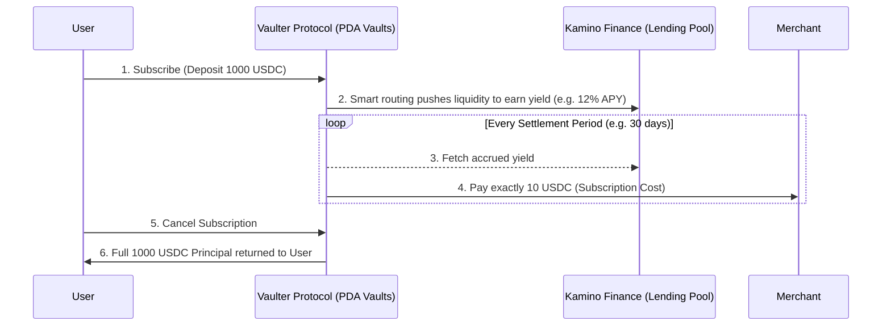

<div align="center">
  
  <h1>Vaulter</h1>
  <p><strong>Self-Paying On-Chain Financial Instruments</strong></p>
  <p>
    <a href="#-the-problem">Problem</a> • 
    <a href="#-the-solution-self-paying-subscriptions">Solution</a> • 
    <a href="#-architecture--kamino-finance-integration">Architecture</a> • 
    <a href="#-quick-start">Quick Start</a>
  </p>
  <p>
    
    
    
  </p>
</div>

---

Vaulter is a novel Solana-based DeFi primitive that enables **"set-and-forget" recurring payments powered entirely by yield**. Rather than slowly draining capital to pay for monthly services, users deposit a principal sum into a smart contract vault routed through Kamino Finance. The generated interest pays the merchant automatically, while your original deposit remains untouched and fully withdrawable.

## 🚀 The Problem

Current Web3 subscription models face critical limitations preventing mainstream adoption:
1. **Failing UX**: Users must manually sign a new transaction every month, inevitably leading to missed payments and high merchant churn.
2. **Opportunity Cost**: Users' funds sit idle in non-yield-bearing payment contracts when they could be generating 10%+ APY elsewhere in DeFi.
3. **Smart Contract Risk**: Standard auto-debit protocols require granting infinite token allowances to third-party contracts.

## 💎 The Solution: "Self-Paying" Subscriptions

Vaulter flips the payment model from an *expense* to an *investment*.

- **For Subscribers**: You deposit USDC into a protocol-managed Vault. The Vaulter engine automatically generates yield using established protocols (like **Kamino Finance**). That yield is streamed to the merchant continuously. If you ever want to stop the subscription, simply hit "Cancel" and withdraw your initial principal instantly.
- **For Merchants**: You launch a secure "Merchant Plan" on-chain and receive a perpetual, default-free stream of yield-backed settlements directly into your treasury.

## 🏗 Architecture & Kamino Finance Integration

This protocol utilizes **Solana** for its low fees (which enables micro-settlements) and **Anchor (Rust)** for its core program logic.

To provide safe, institutional-grade yield, Vaulter routes underlying vault liquidity to **Kamino Finance's lending pools**. 



### Protocol Mechanics

1. **MerchantPlan**: Defines pricing (e.g., 10 USDC / 30 Days) and creates a PDA Vault.
2. **UserSubscription**: Program account keeping state of principal deposited, yield extracted, and settlement epochs.
3. **Permissionless Settlement Crank**: The `settle()` instruction is permissionless. Anyone (or a background cron/crank job) can call it to calculate elapsed time, attribute Kamino's yield to the vault, and debit the exact merchant fees. If yield isn't enough to cover the fee, it deducts from the principal.

---

## 💻 Tech Stack
| Component | Technology |
| --- | --- |
| **Smart Contracts** | Rust, Anchor Framework 0.32.x |
| **Integrations** | Kamino Finance (Yield Source) |
| **Frontend** | React 18, Vite, TypeScript |
| **UI/UX** | Tailwind CSS v4, Lucide React, Three.js (`tsparticles`) |
| **Blockchain** | Solana Devnet / Localnet |

---

## ⚡ Quick Start

### 1. Build the Solana Program

Ensure you have Rust (`v1.89.0`), Solana CLI, and Anchor CLI installed. 
*Note: Due to Rust 1.89 Cargo.lock v4 formats, please ensure your Anchor version matches or downgrade your lockfile to v3 if needed.*

```bash
# Install dependencies
yarn install

# Build Anchor program
anchor build

# Test the core logic
anchor test
```

### 2. Run the Web3 Application

The frontend uses the latest standards for an extremely fast load time.

```bash
cd app
npm install
npm run dev
```

Navigate to `http://localhost:5173` to explore the Merchant and Subscriber portals. The interface interacts directly with the deployed Devnet program.

---

> _"Why pay for SaaS, when your capital can pay it for you?"_ — Vaulter Team
